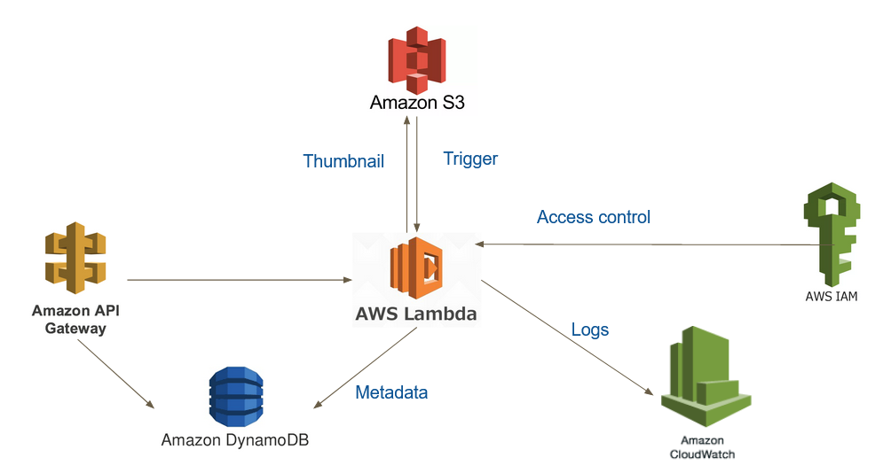
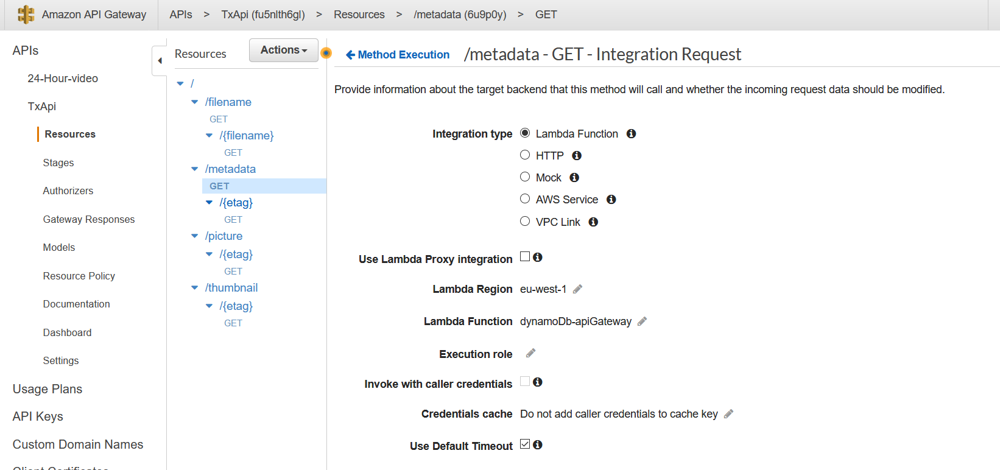

# TX-Serverless-Computing-2019
Presentaiton
------------
* This project is a serverless version of [Steatite](https://github.com/Hypertopic/Steatite). 

* Its structure is as following. 



Amazon Simple Storage Service(S3)
---------------------------------
* There are two S3 buckets in this project, one is 'tx-picture' for all the original images, another is 'tx-vignette' for thumbnails. 
To create a bucket is simple, in the console, click on Create a bucket, enter the bucket name then click create. 


* Then in the bucket, edit Block public access settings under the Tab Permissions.


* We also need to edit the bucket policy. 

```
{
    "Version": "2012-10-17",
    "Id": "Policy1557411810501",
    "Statement": [
        {
            "Sid": "Stmt1557411804169",
            "Effect": "Allow",
            "Principal": {
                "AWS": "arn:aws:iam::user-number:user/upload-s3"
            },
            "Action": [
                "s3:PutObject",
                "s3:PutObjectAcl",
                "s3:GetObject",
                "s3:GetObjectAcl",
                "s3:DeleteObject"
            ],
            "Resource": "arn:aws:s3:::tx-picture/*"
        }
    ]
}
```


Create a IAM role for Lambda function
-------------------------------------
* In the console of IAM, choose Create role. Then choose Lambda. 


* In the next step, choose all the policies we need : CloudWatchLogsReadOnlyAccess, AmazonS3FullAccess and AmazonDynamoDBFullAccess. For DynamoDb, we need to specifiy the table name. 


* Then review the role and create. 


Create Lambda function
----------------------
* Create a lambda function as following. Use the role that we've created before. 


* After the function created, add a trigger of S3 to Lambda. 


* Set time out to 30 secondes. 


* Then upload the zip file of the folder [lambda function](./lambda-function). Please make sure that you zip all the files in the folder but not the folder itself. 

* The deployment packages of Exiftool et Netpbm is created by using EC2. [Documentation](https://aws.amazon.com/premiumsupport/knowledge-center/lambda-linux-binary-package/?nc1=h_ls)

* In order to run Netpbm sucessfully, we also need to edit the Environment variables in Lambda. To do so, we need to run `echo $PATH` in the terminal of Cloud9. Copy the PATH and add `:/var/task` at the end. 


DynamoDB
--------
* Create two tables. One is StetiteMeta with `etag` being its primary key, another is SteatiteName with `filename` being its primary key. 


API Gateway
-----------
* First of all, create API. Choose REST API. 


* On using the button Actions, create ressources and method GET as following. 


* Create a IAM role for API Gateway, grant it a Query of DynamoDB. 
* Now we need to configure every method GET. 

 `/filename/{filename} - GET` and `/metadata/{etag} - GET`


```
{
    "TableName": "SteatiteMeta",
    "PrimaryKey": "etag",
    "KeyConditionExpression": "etag = :v1",
    "ExpressionAttributeValues": {
        ":v1": {
            "S": "$input.params('etag')"
        }
    }
}
```
`/filename - GET` and `/metadata - GET`

Lambda functions : [dynamoDb-metadata-apiGateway](./dynamoDb-metadata-apiGateway.js) and [dynamoDb-filename-apiGateway](./dynamoDb-filename-apiGateway.js)



`/thumbnail/{etag} - GET` and `/picture/{etag} - GET`

Lambda functions : [getVignette](./getVignette.js) and [getPicture](./getPicture.js)

Mapping Templates : 
```
##  See http://docs.aws.amazon.com/apigateway/latest/developerguide/api-gateway-mapping-template-reference.html
##  This template will pass through all parameters including path, querystring, header, stage variables, and context through to the integration endpoint via the body/payload
#set($allParams = $input.params())
{
"body-json" : $input.json('$'),
"params" : {
#foreach($type in $allParams.keySet())
    #set($params = $allParams.get($type))
"$type" : {
    #foreach($paramName in $params.keySet())
    "$paramName" : "$util.escapeJavaScript($params.get($paramName))"
        #if($foreach.hasNext),#end
    #end
}
    #if($foreach.hasNext),#end
#end
},
"stage-variables" : {
#foreach($key in $stageVariables.keySet())
"$key" : "$util.escapeJavaScript($stageVariables.get($key))"
    #if($foreach.hasNext),#end
#end
},
"context" : {
    "account-id" : "$context.identity.accountId",
    "api-id" : "$context.apiId",
    "api-key" : "$context.identity.apiKey",
    "authorizer-principal-id" : "$context.authorizer.principalId",
    "caller" : "$context.identity.caller",
    "cognito-authentication-provider" : "$context.identity.cognitoAuthenticationProvider",
    "cognito-authentication-type" : "$context.identity.cognitoAuthenticationType",
    "cognito-identity-id" : "$context.identity.cognitoIdentityId",
    "cognito-identity-pool-id" : "$context.identity.cognitoIdentityPoolId",
    "http-method" : "$context.httpMethod",
    "stage" : "$context.stage",
    "source-ip" : "$context.identity.sourceIp",
    "user" : "$context.identity.user",
    "user-agent" : "$context.identity.userAgent",
    "user-arn" : "$context.identity.userArn",
    "request-id" : "$context.requestId",
    "resource-id" : "$context.resourceId",
    "resource-path" : "$context.resourcePath"
    }
}
```


* In the end, Deploy API. 

Possible errors and solutions
---------------
* PATH doesn't work. Delete the PATh, then add `./` for Netpbm, add `./` also for anytopnm. 
```
process.execSync('./anytopnm /tmp/image|./pamscale -height 100|./pnmtojpeg > /tmp/tmpImage');
```
```
    jfif )
        ./jpegtopnm "$file"
        ;;

    png )
        ./pngtopnm "$file"
        ;;
```
* 'Permission denied'. In the terminal of Cloud9, run a `chmod 755 *`. 
